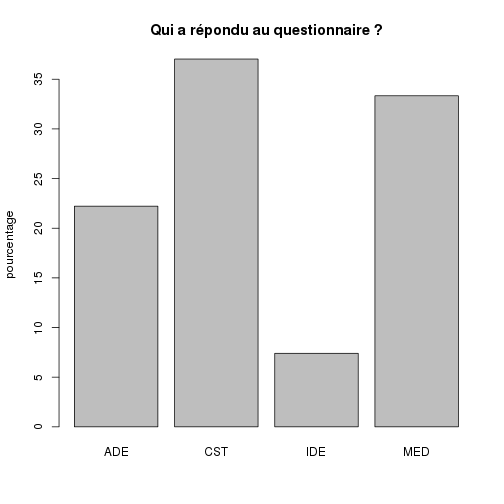
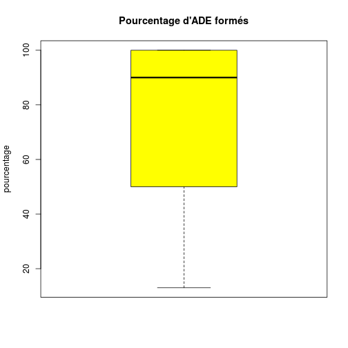
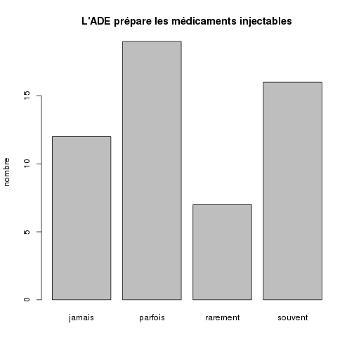
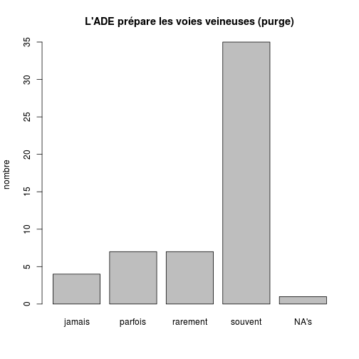
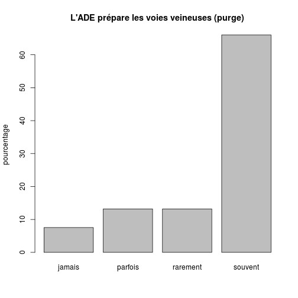
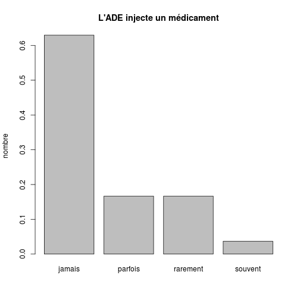

Etude Stiker
========================================================


```
##  [1] "SAMU"          "SMUR"          "Fonction"      "F2"           
##  [5] "Q1"            "Q2"            "pourcent"      "Q3"           
##  [9] "Q4"            "Q5"            "Q6"            "autre_diplome"
```

```
## 'data.frame':	54 obs. of  12 variables:
##  $ SAMU         : Factor w/ 39 levels "1","15","17",..: 1 16 27 2 3 4 4 5 5 6 ...
##  $ SMUR         : Factor w/ 46 levels "ALBI","AMIENS",..: 9 31 16 5 23 11 10 12 38 32 ...
##  $ Fonction     : Factor w/ 4 levels "ADE","CST","IDE",..: 2 2 2 4 2 4 2 1 2 3 ...
##  $ F2           : Factor w/ 3 levels "","CS","IADE": 1 1 1 1 3 2 1 1 3 1 ...
##  $ Q1           : Factor w/ 2 levels "non","oui": 2 2 2 2 2 2 2 2 2 2 ...
##  $ Q2           : Factor w/ 2 levels "non","oui": 2 2 2 2 2 2 2 2 2 2 ...
##  $ pourcent     : int  100 NA 50 100 NA NA 45 NA 100 90 ...
##  $ Q3           : Factor w/ 4 levels "jamais","parfois",..: 1 2 4 2 2 2 4 4 3 4 ...
##  $ Q4           : Factor w/ 4 levels "jamais","parfois",..: 3 4 4 4 3 2 4 4 2 4 ...
##  $ Q5           : Factor w/ 4 levels "jamais","parfois",..: 1 1 4 2 1 1 2 1 1 3 ...
##  $ Q6           : Factor w/ 4 levels "autre","FI","non",..: 3 3 1 2 3 3 1 1 3 2 ...
##  $ autre_diplome: Factor w/ 2 levels "","SPP": 1 1 1 1 1 1 1 1 1 1 ...
```

Données de base:

```
## [1] "nombre de questionnaires exploitables: 54"
```

```
## [1] "nombre de SMUR ayant répondu: 46"
```

```
## [1] "correspondants à  39  SAMU."
```

Qualité des personnes ayant répondu:

```
## ADE CST IDE MED 
##  12  20   4  18
```

 

Pour les médecins, il s'agit du chef de service dans 10 cas et le cadre de santé est une IADE dans 6 cas.

Les conducteurs sont titulaires de CCA

```
## non oui 
##   1  53
```

Les ambulanciers ont suivis une FAE ?

```
## non oui 
##   5  49
```

Pourcentage de personnel formés

```
##    Min. 1st Qu.  Median    Mean 3rd Qu.    Max.    NA's 
##    13.0    50.0    90.0    77.3   100.0   100.0      18
```

 

Les ambulanciers préparent les médicaments
------------------------------------------

```
##   jamais  parfois rarement  souvent 
##       12       19        7       16
```

  

Les ambulanciers préparent les voies veineuses
----------------------------------------------
  

Les ambulanciers injectent les médicaments
------------------------------------------
  


